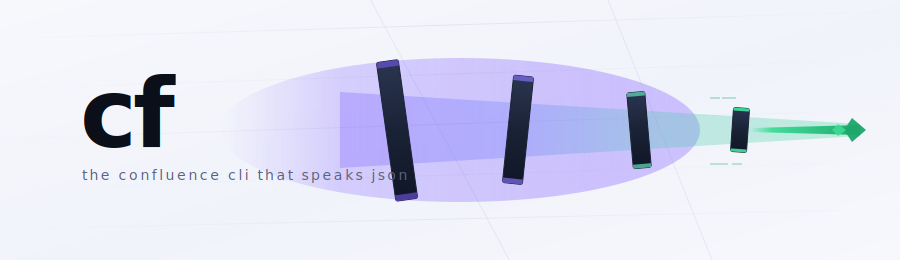
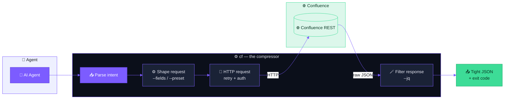

<a id="top"></a>

<div align="center">

<picture>
  <source media="(prefers-color-scheme: dark)" srcset=".github/readme/banner-dark.svg">
  
</picture>

</div>

<table align="center" width="100%"><tr>
<td width="80" align="center" valign="middle">

</td>
<td valign="middle">

# cf

**The Confluence CLI that speaks JSON — built for AI agents.**
Pure JSON on stdout. Structured errors on stderr. Semantic exit codes. 200+ auto-generated commands. Zero prompts, zero interactivity.

</td></tr></table>

<div align="center">

[](https://github.com/sofq/confluence-cli/releases)
[](https://github.com/sofq/confluence-cli/actions/workflows/ci.yml)
[](https://codecov.io/gh/sofq/confluence-cli)
[](go.mod)
[](LICENSE)
[](https://github.com/sofq/confluence-cli/stargazers)

</div>

🧭 [Mental model](#mental-model) · 📦 [Install](#install) · ⚡ [Quickstart](#quickstart) · ✨ [Features](#features) · 🛠 [Workflow](#workflow) · 📖 [Commands](#commands) · ⚙️ [Configuration](#configuration) · 🔒 [Security](#security) · 🤖 [Agent integration](#agent-integration) · 🧪 [Development](#development)

---

## Overview

`cf` wraps the Confluence Cloud REST API in a CLI designed for **machines first, humans second**. Every command emits a single JSON document on stdout. Every error is a structured object on stderr. Every exit code maps to a recoverable agent action. No spinners, no colors, no prompts, no surprises.

> [!TIP]
> Use `--preset agent`, `--fields`, and `--jq` together to compress an 8KB Confluence response down to ~50 tokens before it ever reaches the model.

## Mental model

`cf` is a **conduit**: agent intent enters wide, gets shaped by flags, leaves Confluence as raw JSON, and arrives back at the agent narrowed to exactly what it needs.



Three properties make this work:

- **Self-describing.** `cf schema` returns the full operation graph — no command lists to memorize.
- **Compressible.** `--preset` / `--fields` / `--jq` stack to drop response size by orders of magnitude.
- **Recoverable.** Every failure is a typed exit code an agent can branch on.

## Install

**Using `npm`**

```bash
npm install -g confluence-cf
```

**Using `pip`**

```bash
pip install confluence-cf
```

**Using `brew`** &nbsp;·&nbsp; macOS / Linux

```bash
brew install sofq/tap/cf
```

**Using `scoop`** &nbsp;·&nbsp; Windows

```bash
scoop bucket add sofq https://github.com/sofq/scoop-bucket
scoop install cf
```

**Using `go install`**

```bash
go install github.com/sofq/confluence-cli@latest
```

**Prebuilt binaries** — download from [Releases](https://github.com/sofq/confluence-cli/releases) and drop on your `PATH`.

## Quickstart

```bash
cf configure --base-url https://yoursite.atlassian.net --token YOUR_API_TOKEN
cf pages get --id 12345 --preset agent
```

```json
{"id":"12345","title":"Deploy Runbook","status":"current","version":5}
```

> [!NOTE]
> Get a Confluence API token at https://id.atlassian.com/manage-profile/security/api-tokens. `cf configure --test` validates credentials before you commit them to a profile.

## Features

<table>
<tr>
<td align="center" width="33%" valign="top">
<br>
<b>200+ commands, generated</b><br>
<sub>Every Confluence v2 endpoint as a typed subcommand, regenerated from the official OpenAPI spec.</sub>
</td>
<td align="center" width="33%" valign="top">
<br>
<b>Token-efficient by design</b><br>
<sub><code>--preset</code>, <code>--fields</code>, and <code>--jq</code> stack to compress an 8KB response into 50 tokens.</sub>
</td>
<td align="center" width="33%" valign="top">
<br>
<b>CQL search</b><br>
<sub>Full Confluence Query Language access for filtering by space, type, label, modified time, and more.</sub>
</td>
</tr>
<tr>
<td align="center" width="33%" valign="top">
<br>
<b>Streaming watch</b><br>
<sub>NDJSON event stream for created / updated / removed pages — pipe straight into an agent loop.</sub>
</td>
<td align="center" width="33%" valign="top">
<br>
<b>Batch in one process</b><br>
<sub>Run N operations from a single JSON array. Batch exit code = highest severity across the set.</sub>
</td>
<td align="center" width="33%" valign="top">
<br>
<b>Per-profile policy</b><br>
<sub>Glob-based allow / deny lists, audit logging, and batch caps make `cf` safe to hand to an agent.</sub>
</td>
</tr>
</table>

## Workflow

| Use case | Command |
|---|---|
| Read a page, only what the model needs | `cf pages get --id 12345 --preset agent` |
| Find recently-updated pages in a space | `cf search search-content --cql "space = DEV AND lastModified > now('-7d')" --jq '.results[] \| {id, title}'` |
| Create a page from XHTML body | `cf pages create --spaceId 123456 --title "Runbook" --body "<p>Steps...</p>"` |
| Update a page (version-checked) | `cf pages update --id 12345 --version-number 3 --title "Runbook v2" --body "<p>...</p>"` |
| Diff what changed in the last 2 hours | `cf diff --id 12345 --since 2h` |
| Export a page tree as JSON | `cf export --id 12345 --tree` |
| Watch a space for changes | `cf watch --cql "space = DEV" --interval 30s --max-events 50` |
| Move, copy, archive, comment | `cf workflow move \| copy \| archive \| comment ...` |
| Add and remove labels | `cf labels add --page-id 12345 --name reviewed` |
| Upload an attachment | `cf attachments upload --page-id 12345 --file ./diagram.png` |
| Run multiple ops in one process | `echo '[...]' \| cf batch` |
| Hit any v2 endpoint directly | `cf raw GET /wiki/api/v2/pages/12345` |

<details>
<summary><b>Streaming output sample (<code>cf watch</code>)</b></summary>

```json
{"event":"updated","id":"12345","title":"Deploy Runbook","version":5,"when":"2026-04-07T10:15:00Z"}
{"event":"created","id":"67890","title":"New RFC","version":1,"when":"2026-04-07T10:16:30Z"}
```

Events: `initial`, `created`, `updated`, `removed`. Always pair `--interval` with `--max-events` in unattended contexts.

</details>

<details>
<summary><b>Diff output sample (<code>cf diff</code>)</b></summary>

```json
{"version_from":3,"version_to":5,"title_changed":true,"body":{"added":12,"removed":4,"changed":8}}
```

</details>

## Commands

Self-describing — discover the full surface from the binary itself.

```bash
cf schema                     # resource → verbs map
cf schema --list              # resource names only
cf schema pages               # operations on `pages`
cf schema pages get           # full flag schema for one operation
cf preset list                # named output presets
```

| Resource | Verbs |
|---|---|
| `pages` | `get` `list` `create` `update` `delete` |
| `blogposts` | `get` `list` `create` `update` `delete` |
| `spaces` | `get` `list` |
| `comments` | `list` `create` `update` `delete` |
| `attachments` | `list` `upload` `download` `delete` |
| `labels` | `add` `remove` `list` |
| `custom-content` | `get` `list` `create` `update` `delete` |
| `search` | `search-content` `search-user` |
| `workflow` | `move` `copy` `archive` `restrict` `comment` |
| `diff` | `diff` |
| `export` | `export` |
| `watch` | `watch` |
| `batch` | `batch` |
| `raw` | `GET` `POST` `PUT` `PATCH` `DELETE` |

### Global flags

| Flag | Purpose |
|---|---|
| `--preset <name>` | Named output preset (`agent`, `brief`, `titles`, `meta`, `tree`, `search`, `diff`) |
| `--jq <expr>` | jq filter applied to the response |
| `--fields <list>` | Comma-separated Confluence field selector (GET only) |
| `--cache <duration>` | Cache GET responses (`5m`, `1h`, …) |
| `--no-paginate` | Disable auto-pagination |
| `--dry-run` | Print the request without executing it |
| `--verbose` | Log HTTP details to stderr as JSON |
| `--timeout <duration>` | HTTP request timeout (default `30s`) |
| `--profile <name>` | Use a named config profile |
| `--audit <path>` | NDJSON audit log file |
| `--max-batch <N>` | Cap on operations per batch (default `50`) |
| `--pretty` | Pretty-print JSON output |

### Exit code contract

```json
{"error_type":"rate_limited","status":429,"retry_after":30}
```

| Exit | Meaning | Agent action |
|---|---|---|
| `0` | OK | Parse stdout |
| `1` | General error | Inspect stderr |
| `2` | Auth failed | Re-authenticate |
| `3` | Not found | Check page ID |
| `4` | Validation | Fix input |
| `5` | Rate limited | Wait `retry_after` seconds |
| `6` | Permission | Check access |

## Configuration

Profiles live in `~/.config/cf/config.json`. Each profile holds a base URL, auth, and an optional operation policy.

```json
{
  "profiles": {
    "default": {
      "base_url": "https://yoursite.atlassian.net",
      "auth": { "type": "basic", "token": "..." }
    },
    "agent": {
      "base_url": "https://yoursite.atlassian.net",
      "auth": { "type": "basic", "token": "..." },
      "allowed_operations": ["pages get", "search *", "workflow comment"]
    },
    "readonly": {
      "base_url": "https://yoursite.atlassian.net",
      "auth": { "type": "basic", "token": "..." },
      "denied_operations": ["* delete*", "* create*", "* update*", "raw *"]
    }
  }
}
```

```bash
cf configure --base-url https://yoursite.atlassian.net --token YOUR_TOKEN
cf configure --test                          # validate the default profile
cf configure --test --profile agent          # validate one profile
cf configure --profile readonly --delete     # remove a profile
```

## Security

| Layer | What it does |
|---|---|
| **Operation policies** | Per profile, glob-based `allowed_operations` (deny-by-default) **or** `denied_operations` (allow-by-default). Patterns: `pages get`, `* delete*`, `workflow *`. |
| **Audit log** | `--audit ./audit.log` — emits one NDJSON record per call (timestamp, profile, command, exit code). Configurable per profile. |
| **Batch cap** | Default 50 operations per `cf batch` invocation. Override with `--max-batch N`. |
| **No interactive prompts** | An attacker can't trick `cf` into reading from a TTY mid-command — there is no TTY path. |
| **Secrets in config only** | Tokens are never accepted as positional args; only via `cf configure` or env. |

Vulnerability reports: [SECURITY.md](SECURITY.md).

## Agent integration

### Claude Code skill (included)

```bash
cp -r skill/confluence-cli ~/.claude/skills/
```

The skill teaches Claude Code the cf command surface, presets, and exit-code contract directly — no system prompt edits needed.

### Any other agent

Drop this into your agent's system prompt:

```
Use `cf` for all Confluence operations. Output is always JSON on stdout.
Run `cf schema` first to discover available commands.
Use `--preset agent` or `--jq` to minimize tokens.
On non-zero exit, parse stderr for {error_type, status, retry_after}.
Exit codes: 0=ok 1=error 2=auth 3=not_found 4=validation 5=rate_limited 6=permission.
```

## Development

```bash
make build          # build the cf binary
make test           # run all tests with race detection
make lint           # golangci-lint
make generate       # regenerate commands from the Confluence OpenAPI spec
make spec-update    # download the latest OpenAPI spec
make docs-dev       # serve the VitePress doc site locally
make docs-build     # build the static doc site
make clean          # remove build artifacts
```

The generated command tree under `cmd/` is rebuilt by `make generate` from `spec/confluence-v2.json`. Hand-written commands live alongside the generated ones — anything in `cmd/` ending in `_test.go` is excluded from generation.

<p align="right"><a href="#top">↑ Back to top</a></p>

<picture>
  <source media="(prefers-color-scheme: dark)" srcset=".github/readme/divider.svg">
  
</picture>

## License

[Apache 2.0](LICENSE) © sofq
